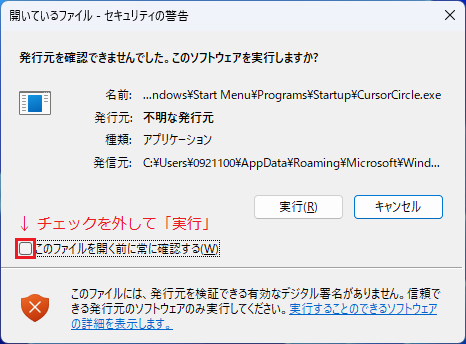
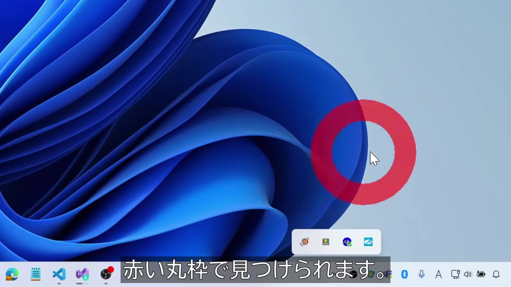

マウスカーソルを見失った時、マウスを左右にわしゃわしゃすると、赤い丸枠が表示されて＼ここだよ！／と教えてくれます。  
Windows専用です。

### ビルド方法

`HOW-TO-BUILD.md` を参照。  
（ビルド済みのEXEファイルだけダウンロードしたい場合、本手順をスキップし次の手順へ）

### インストール方法

1. `HOW-TO-BUILD.md` に従い `CursorCircle.exe` を得た場合はそのEXEファイルを、  
   そうでない場合は https://github.com/takahashimasaki4biz/CursorCircle/releases からEXEファイルを取得します。

2. [Windows]+R で「ファイル名を指定して実行」を開きます。  
   `%AppData%\Microsoft\Windows\Start Menu\Programs\Startup` を入力し、OKボタンを押します。

3. Explorerで開いたこのディレクトリに、`CursorCircle.exe`（又はそのショートカット）を置きます。  
  これにより、次回Windowsサインイン時にスタートアップとして自動で起動される様になります。  
  （初回は `CursorCircle.exe` をダブルクリックすれば起動できます）

4. 一度だけ、以下の警告が出るかもしれませんが、チェックボックを外して「実行」して下さい。  
   （発行元はオレオレ設定しています。心配でしょうが信じて下さい）
> 

### 使用方法

1. マウスを左右に激しくわしゃわしゃして下さい。

> 
